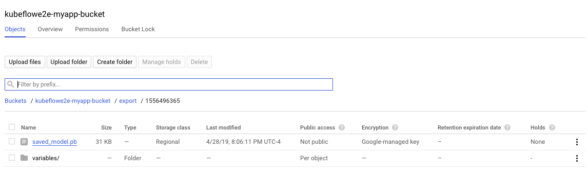
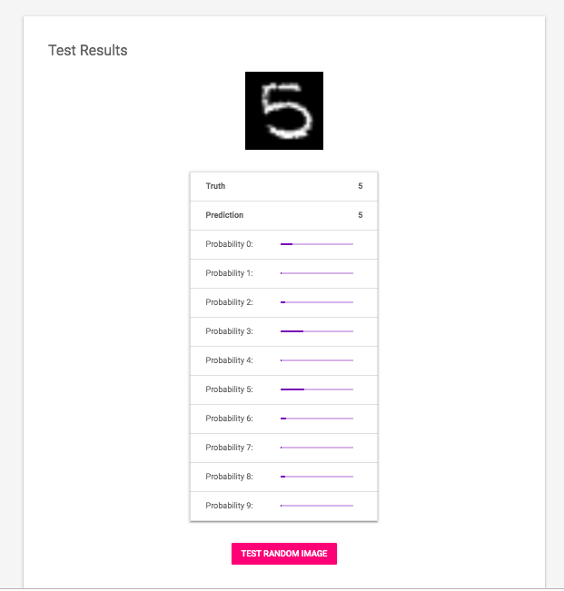

# End to End Kubeflow

------

This tutorial is a heavily edited version of <https://www.kubeflow.org/docs/gke/gcp-e2e/>.

## 1. Set up ksonnet app and model


In the cloud shell, you may need to run the command `source setup.sh`. You will need to do this any time you reconnect to the cloud shell.

 Lets clone down the code for our model

```bash
git clone https://github.com/kubeflow/examples.git
cd examples/mnist
export WORKING_DIR=$(pwd)
export KS_NAME="my_ksonnet_app"
```

Add the last 3 lines to a file, model.sh:

```bash
cd ~/examples/mnist
export WORKING_DIR=$(pwd)
export KS_NAME="my_ksonnet_app"
```

Then run `source model.sh`. This should leave you in `~/examples/mnist`.

Take a look at `model.py` in `examples/mnist`. This is the model we'll be running.

Now we'll set up a `ksonnet` app. From the `WORKING_DIR` do the following:

```bash
ks init ${KS_NAME}
cd ${KS_NAME}
cp -a ${WORKING_DIR}/ks_app/components/* ${WORKING_DIR}/${KS_NAME}/components/
ks registry add kubeflow github.com/kubeflow/kubeflow/tree/${KUBEFLOW_VERSION}/kubeflow
ks pkg install kubeflow/tf-serving@${KUBEFLOW_VERSION}

```

This sets up our `ksonnet` app and installs the tensorflow serving package as well.

## 2. Docker our model and set params


(1) **Docker Build**: We'll run the following docker build code:

```bash
export VERSION_TAG=$(date +%s)
export TRAIN_IMG_PATH=gcr.io/${PROJECT}/${DEPLOYMENT_NAME}-train:${VERSION_TAG}
docker build $WORKING_DIR -t $TRAIN_IMG_PATH -f $WORKING_DIR/Dockerfile.model
```

Read `Dockerfile.model` to see how the container is run. Lets test it locally on our google cloud shell.

```bash
docker run -it ${TRAIN_IMG_PATH}
```

CTRL-C to get out of this (rather slow) training loop.

Now we need to upload our image to the google container registry. Authenticate, then push

```bash
gcloud auth configure-docker --quiet
docker push ${TRAIN_IMG_PATH}
```

Wait until the process is complete, then you should see your new container image listed on the [Container Registry page](https://console.cloud.google.com/gcr) on the GCP console.

(2) **Param Setting**: Now we need to set some `ksonnet` params to have our model running on the cluster:

```bash
ks param set train name "train-"${VERSION_TAG}
ks param set train image ${TRAIN_IMG_PATH}
ks param set train modelDir "gs://"${BUCKET_NAME}
ks param set train exportDir "gs://"${BUCKET_NAME}/export
ks param list train
```

The last command lists the params.

 You need to ensure that your Python code has the required permissions to read/write to your Cloud Storage bucket. Kubeflow solves this by creating a [service account](https://cloud.google.com/iam/docs/understanding-service-accounts) within your project as a part of the deployment. You can verify this by listing your service accounts:

```bash
gcloud iam service-accounts list | grep ${DEPLOYMENT_NAME}
```

Kubeflow granted this service account the right permissions to read and write to your storage bucket. Kubeflow also added a [Kubernetes secret](https://kubernetes.io/docs/concepts/configuration/secret/) named `user-gcp-sa` to your cluster, containing the credentials needed to authenticate as this service account within the cluster:

```bash
kubectl describe secret user-gcp-sa
```

To access your storage bucket from inside the `train` container, you must set the [GOOGLE_APPLICATION_CREDENTIALS](https://cloud.google.com/docs/authentication/getting-started) environment variable to point to the JSON file contained in the secret. Set the variable by passing the following parameters to the `train.jsonnet` component:

```bash
ks param set train secret user-gcp-sa=/var/secrets
ks param set train envVariables GOOGLE_APPLICATION_CREDENTIALS=/var/secrets/user-gcp-sa.json
```

## 3. Train Train Train (finally!)

[Apply](https://github.com/ksonnet/ksonnet/blob/master/docs/cli-reference/ks_apply.md) the container to the cluster. The following ksonnet command applies the container in the `default` [ksonnet environment](https://github.com/ksonnet/ksonnet/blob/master/docs/concepts.md#environment), because the downloaded sample provides only the default environment:

```bash
ks apply default -c train
```

When the command finishes running, there should be a new workload on the cluster, with a name like `train-<VERSION_TAG>-chief-0`.

You can see the workloads on the [GKE Workloads page](https://console.cloud.google.com/kubernetes/workload) on the GCP console. To see the logs, click the workload, then click **Container logs**.

When training is complete, you should see the model data pushed into your Cloud Storage bucket, tagged with the same version number as the container that generated it. To explore, click your bucket name on the [Cloud Storage page](https://console.cloud.google.com/storage) on the GCP Console.

Typically you will want to do many runs after changing things. Not talking here about hyperparameter optimization (more on that soon). For that, build a new image with a new version tag and a new path, and then do something like:

```bash
ks param set train name "train-"${VERSION_TAG}
ks param set train image ${TRAIN_IMG_PATH}
#Delete and re-apply the component to the cluster with the following commands:

ks delete default -c train
ks apply default -c train
```

The model (and other training stuff) are dumped into our gs bucket. (gs buckets are also supported by Dask and are a simpler alternative to getting data in and out of Kubernetes clusters as compared to PersistentVolumes and PersistentVolumeClaims.)



## 4. Serve and UI your model

(1) Lets serve our model tensorflow-serving!

Look at the components in your `${WORKING_DIR}/my_ksonnet_app/components` directory. The relevant configuration files in that directory are `mnist-deploy-gcp.jsonnet` and `mnist-service.jsonnet`.


Let us set up some parameters in `ksonnet` and [apply](https://github.com/ksonnet/ksonnet/blob/master/docs/cli-reference/ks_apply.md) the component to the cluster:

```bash
ks param set mnist-deploy-gcp modelBasePath "gs://"${BUCKET_NAME}/export
ks param set mnist-deploy-gcp modelName mnist
ks apply default -c mnist-deploy-gcp
ks apply default -c mnist-service
```

There should now be a new workload on the cluster, with the name `mnist-deploy-gcp`. You can see the **mnist-service** service on the [GKE Services page](https://console.cloud.google.com/kubernetes/discovery). If you click through to see the service details, you can see that it listens for connections within the cluster on port 9000.

(2) What if we want a UI? We'll need to deploy this. The workflow we'll use is similar to our training workflow. Our code gets wrapped into a docker image which is then scheduled onto a pod on our kubernetes cluster. The web UI code is stored in the `${WORKING_DIR}/web-ui` directory, with a dockerfile to build an appropriate image

```bash
cd ${WORKING_DIR}
export UI_IMG_PATH=gcr.io/${PROJECT}/${DEPLOYMENT_NAME}-web-ui
docker build ${WORKING_DIR}/web-ui -t ${UI_IMG_PATH}
docker push ${UI_IMG_PATH}
```

You can see our docker images at the google container registry:


Ok, now to install using ksonnet:

```bash
cd ${WORKING_DIR}/my_ksonnet_app
ks param set web-ui image ${UI_IMG_PATH}
ks param set web-ui type LoadBalancer
ks apply default -c web-ui
```


As you see we need to set params on the `ksonnet` app and apply it to the cluster. You can see the **web-ui** entry on the [GKE Workloads page](https://console.cloud.google.com/kubernetes/workload) and on the [Services page](https://console.cloud.google.com/kubernetes/discovery).

1. Find the IP address assigned to the service:

   ```bash
   kubectl get service web-ui
   ```

2. Copy the value shown under `EXTERNAL-IP` and paste it into your web browser’s address bar. The web UI should appear.

   

## 5. Clean up and dont incur costs!

Run the following command to delete your deployment and related resources:

```bash
gcloud deployment-manager --project=${PROJECT} deployments delete ${DEPLOYMENT_NAME}
```

Delete your Cloud Storage bucket when you’ve finished with it:

```bash
gsutil rm -r gs://${BUCKET_NAME}
```

Delete the container images uploaded to Container Registry:

```bash
// Find the digest id for each container image:
gcloud container images list-tags us.gcr.io/$PROJECT/kubeflow-train
gcloud container images list-tags us.gcr.io/$PROJECT/kubeflow-web-ui

// Delete each image:
gcloud container images delete us.gcr.io/$PROJECT/kubeflow-web-ui:$DIGEST_ID
gcloud container images delete us.gcr.io/$PROJECT/kubeflow-train:$DIGEST_ID
```

As an alternative to the command line, you can delete the various resources using the [GCP Console](https://console.cloud.google.com/cloud-resource-manager).