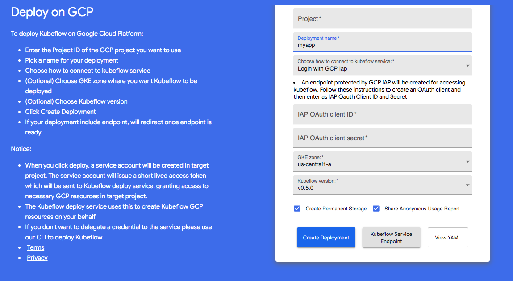

# Kubeflow Setup

---

This tutorial is a heavily edited version of <https://www.kubeflow.org/docs/gke/gcp-e2e/>. The deployment aspects for GCP are taken from [here](https://www.kubeflow.org/docs/gke/deploy/).

## 1. GCP Basics


1. We first need to set up a project in GCP. Create a project called `kubeflowe2e` in the GCP console. This will create a project-id that looks something like `kubeflowe2e-238505`. Make sure that billing is enabled for your project. 
2. Also choose a name for your `app`. We'll call it `myapp`. Remember this for now.
3. Go to the following pages on the GCP Console and ensure that the specified APIs are enabled on your GCP account:
   - [Compute Engine API](https://console.cloud.google.com/apis/library/compute.googleapis.com)
   - [GKE API](https://console.cloud.google.com/apis/library/container.googleapis.com)
   - [Identity and Access Management (IAM) API](https://console.cloud.google.com/apis/library/iam.googleapis.com)
   - [Deployment Manager API](https://console.cloud.google.com/apis/library/deploymentmanager.googleapis.com)

## 2. IAP


3. The next step is to set up an OAuth Credential to use a [Cloud Identity-Aware Proxy (Cloud IAP)](https://cloud.google.com/iap/docs/) . To do this, first

   1. Set up your OAuth [consent screen](https://console.cloud.google.com/apis/credentials/consent). For **Application Name** use `myapp`, for **support email**, use the email you used to set up GCP. For **Authorized Domain** use `<project-id>.cloud.goog`. The project-id will be of the form `kubeflowe2e-238505`, that is your preject name followed by a number. Now click **Save**.

      

   2. On clicking Save, you will be moves over to the [credentials tab](https://console.cloud.google.com/apis/credentials) (it is to the left of the current screen in the current web page).

      

      1. Click **Create credentials**, and then click **OAuth client ID**.
      2. Under **Application type**, select **Web application**.
      3. In the **Name** box enter any name for your OAuth client ID. This is *not* the name of your application nor the name of your Kubeflow deployment. It’s just a way to help you identify the OAuth client ID. 
      4. In the **Authorized redirect URIs** box, enter the following: `https://<app>.endpoints.<project-id>.cloud.goog/_gcp_gatekeeper/authenticate`. In place of `<app>` use `myapp` and for `<project-id>` use your project-id which will look something like this: `kubeflowe2e-238505`. For this example the endpoint will end up looking like `https://myapp.endpoints.kubeflowe2e-238505.cloud.goog/_gcp_gatekeeper/authenticate`
      5. Press **Enter/Return** to add the URI. Check that the URI now appears as a confirmed item under **Authorized redirect URIs**. (It should no longer be editable.)
      6. Make note of the **client ID** and **client secret** that appear in the OAuth client window. You need them later to enable Cloud IAP.

      

      

      ## 3. Deploy using UI

   taken from [here](https://www.kubeflow.org/docs/gke/deploy/deploy-ui/)

   

   1. Open [https://deploy.kubeflow.cloud/](https://deploy.kubeflow.cloud/#/deploy) in your web browser.
   2. Sign in using a GCP account that has administrator privileges for your GCP project.
   3. Complete the form, following the instructions on the left side of the form. In particular, ensure that you enter the same **deployment name** as you used when creating the OAuth client ID.
   4. Click **Create Deployment**.

   Kubeflow will be available at the following URI:

   ```
   https://<app>.endpoints.<project-id>.cloud.goog/
   ```

   In our case here it would look like `https://myapp.endpoints.kubeflowe2e-238505.cloud.goog/`. It can take 10-15 minutes for the URI to become available. 

   You can watch for updates in the information box on the deployment UI. If the deployment takes longer than expected, try accessing the above URI anyway.


Take a look around the UI. 


When the cluster is ready, you can do the following:

1. Connect your local `kubectl` session to the cluster:

   ```
   gcloud container clusters get-credentials \
       ${DEPLOYMENT_NAME} --zone ${ZONE} --project ${PROJECT}
   ```

2. Switch to the `kubeflow` namespace to see the resources on the Kubeflow cluster:

   ```
   kubectl config set-context $(kubectl config current-context) --namespace=kubeflow
   ```

3. Check the resources deployed in the `kubeflow` namespace:

   ```
   kubectl get all
   ```

## 4. Set up ksonnet and storage

(1) Run the following lines in the cloud console:

```bash
export KS_VER=0.13.1
export KS_PKG=ks_${KS_VER}_linux_amd64
wget -O /tmp/${KS_PKG}.tar.gz https://github.com/ksonnet/ksonnet/releases/download/v${KS_VER}/${KS_PKG}.tar.gz
tar -xvf /tmp/$KS_PKG.tar.gz -C ${HOME}/local/bin
alias ks="~/local/bin/$KS_PKG/ks"
```

This will set up a command `ks` which is a helm-like software `ksonnet`  to control kubernetes clusters.

(2) Now let us set up a bunch of environment variables to help us:

Put the following code in a file `setup.sh` (replace the stuff between angled brackets by the appropriate variables):

```bash
export KFAPP="<app>"
export ZONE="<zone-from-gui>"
export CLIENT_ID="<client-id>"
export CLIENT_SECRET="<client-secret"
export KS_VER=0.13.1
export KS_PKG=ks_${KS_VER}_linux_amd64
alias ks="~/local/bin/$KS_PKG/ks"
export DEPLOYMENT_NAME=$KFAPP
#For the next line you could do
#export PROJECT="<project-id>"
export PROJECT=${DEVSHELL_PROJECT_ID}
export KUBEFLOW_VERSION="v0.5-branch"
export BUCKET_NAME=${PROJECT}-${DEPLOYMENT_NAME}-bucket
```

Then, in the cloud shell run the command `source setup.sh`. You will need to do this any time you reconnect to the cloud shell.

(3) Now we'll create a storage bucket. Type: `gsutil mb -c regional -l us-central1 gs://${BUCKET_NAME}` .This will create us a google storage bucket.


(4) Since the cluster is ready, you can connect your local `kubectl` session to the cluster:

```bash
gcloud container clusters get-credentials ${DEPLOYMENT_NAME} --zone ${ZONE} --project ${PROJECT}
kubectl get pods
kubectl config current-context
kubectl config set-context $(kubectl config current-context) --namespace=kubeflow
kubectl get pods
```


Now you can also do:

```
kubectl get all
```

## FIN. Destroying it all

See the end to end example for this tutorial. But generally you must kill your deployment, storage buckets, and reclaim space for any registry images you created!

Run the following command to delete your deployment and related resources:

```bash
gcloud deployment-manager --project=${PROJECT} deployments delete ${DEPLOYMENT_NAME}
```

Delete your Cloud Storage bucket when you’ve finished with it:

```bash
gsutil rm -r gs://${BUCKET_NAME}
```